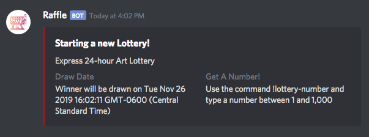

## Run Locally
These instructions will get you a copy of the project up and running on your local machine for development and testing purposes.
### Prerequisites
If you intend to run or test this bot yourself, you **must** have Node.js installed. You can also find instructions bellow on how to host it on Heroku.

### Install
Clone or download this repository and run the following commands from your terminal, to install dependencies before running the bot.

The commands assume your local clone of the repository is in your Downloads folder, and that you didn't renamed the downloaded folder.

```bash
cd ~/Downloads/discord-raffle-master
npm install
```

### Configure
First you'll need to rename de `.env.example` file to `.env` and replace the example value there with your own bot token. If you don't have a bot token yet, you can follow [this guide](https://github.com/reactiflux/discord-irc/wiki/Creating-a-discord-bot-&-getting-a-token) on how to do it.

Once you've set your bot token, you should open the `config.json` file to further configure your bot. The options available are pretty self explanatory:

```json
{
    "prefix": "",
    "admins": [],
    "color": ""
}
```

* The `'prefix'` property defines a unique character that will be used in your server to run commands.
* The `'admins'`property is an array of either usernames or roles that have permission to run special commands, such as starting a raffle and drawing a winner.
* The `'color'` property should be a hexadecimal code, without the `#` symbol, of a color of your preference, used in the Rich Embedded messages that the bot sends when starting a raffle or drawing a winner.

Here's an example:
```json
{
    "prefix": "#",
    "admins": [
       "Administrators",
       "Moderators",
       "AndrykVP"
    ],
    "color": "ffffff"
}
```

### Run Bot
If you've configured your bot properly, you can now run the command bellow on your terminal and get a message that the bot is running

```bash
npm run start
```

## Commands
For the following examples, it's assumed you're using the prefix `#` as configured above. If not, you'd have to replace the command with whatever prefix you configured, so for example if your prefix is `!`, you'd type `!start` instead of `#start` 
### Start a Raffle
To start a raffle all you use the command `#start`. 

```javascript
#start
```

This command will start a raffle with default parameters. It will set a time limit of 24 hours, and set a range of ticket numbers between 1 and 1,000 



You can also define custom parameters for time limit, and a custom message by typing them after the `#start` command. The order is important. It should always be: **time limit** first, in hours; and lastly **message**. 

```javascript
#start 48 This is a custom message
```

All of these parameters are optional, but they must be input in the right order. You can choose to set only the time period, for example, but if you want a custom limit then you must also input a time period.

```javascript
#start 24 50
```

### Take a Number
Once a raffle has started, tickets can be given to a user. An Admin should type `!addtickets <username>`(must be a user tag using the @sign) followed by their desired number of tickets. If no tickets are given, defaults to 1.

```javascript
#addtickets @digitalirony 9999
```
Tickets given are just an incremental number. At this time no custom or random ticket numbers.

### Draw a Winner
At the moment, drawing has to be done manually by typing `#draw`. The bot will then randomly select a winner from the pool and print a message, letting everyone know what the winning number was, and who it belongs to.


